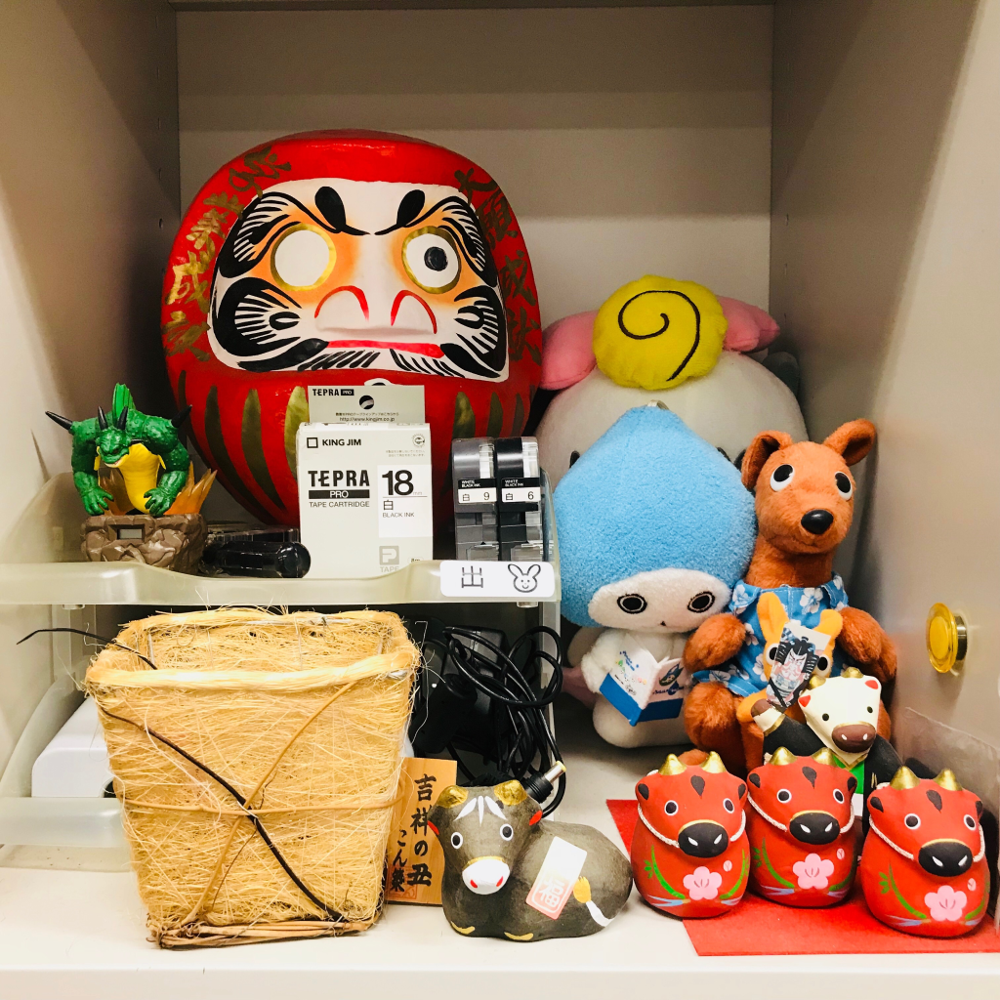
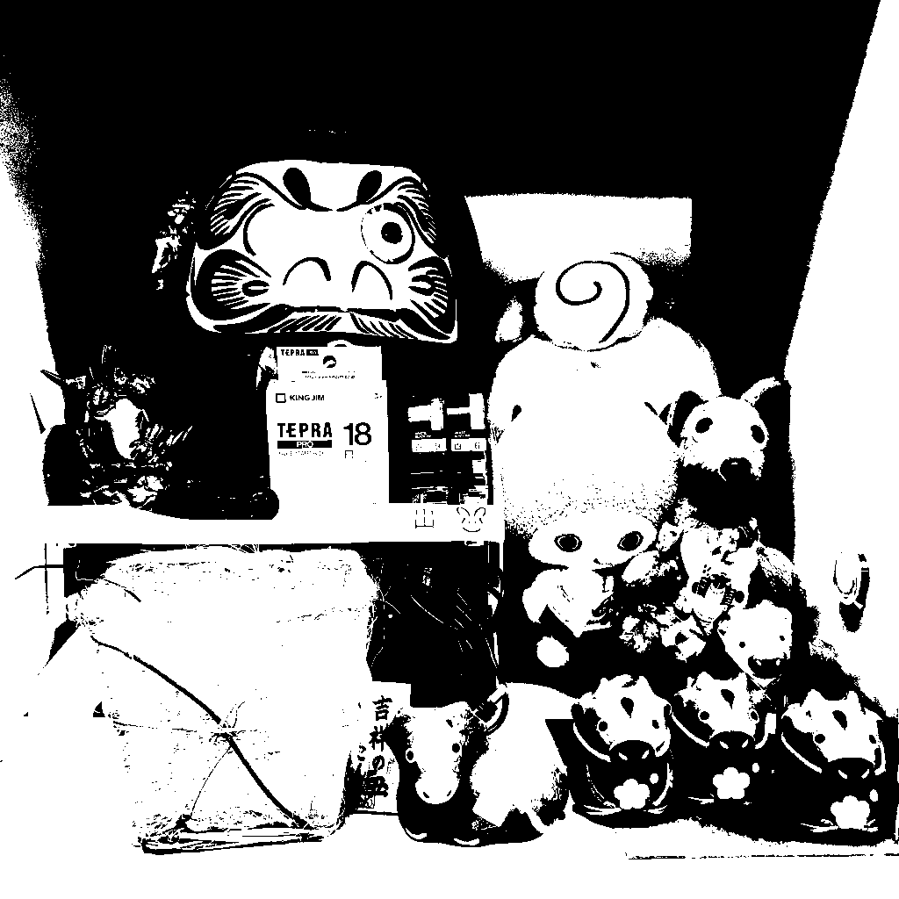
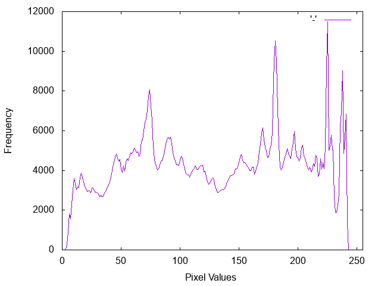

# 先端画像処理・ロボティクス特論 第1回 (2018/10/17) レポート課題

## 学籍番号: AL15069
## 氏名: 小野 義基
<br>

### 共同作業者
- AF15043 坂内力
- AF15045 佐藤康平
<br>

## 概要
- bmpファイルに関して、ヘッダファイルを参照しながら読み書きを行うクラスを実装しました
- 講義を参考に、グレースケール画像、2値化画像、ヒストグラムを生成するプログラムを実装しました
- 再利用やコンパイルの簡易化を目的に、ファイル分割やMakefileの作成を行いました
<br>

## `ソースコード等` ディレクトリの構成
```
ソースコード等/
　├ 1st.cpp    `グレースケール、ヒストグラム、2値化画像などの処理`
　├ bitmap_manager.cpp    `bmp画像の読み書きなどを管理するクラス`
　├ bitmap_manager.hpp    `bitmap_manager用のヘッダ`
　│
　├ src/
　│　├ img.bmp    `元画像1`
　│　├ img2.bmp    `元画像2`
　│　└ img3.bmp    `元画像3`
　│
　├ dst/
　│　├ img_gray.bmp    `グレースケール画像`
　│　├ img_binarization.bmp    `2値化画像`
　│　... img2, img3も同様
　│
　├ histgram/
　│　├ img_histgram.png    `ヒストグラム`
　│　... img2, img3も同様
　│
　└ Makefile    `Makeファイル`
```
<br>


## 使い方

### 準備
- srcフォルダにbmpファイルをおいてください。

### コンパイル方法
``` sh
make
./1st bitmap_filename
```
`bitmap_filename` は `src` ディレクトリに置いた画像の名前です

ex) `img`, `img2`, `img3`

### 出力
- `dst/` -> グレースケール画像、2値化画像
- `histgram/` -> ヒストグラム

### 注意
- グラフは `gnuplot` で生成しています。
- トップダウン方式のbmpファイルは読み込めません。
<br>

## 元画像と出力画像
他の画像での例は `ソースコードなど` フォルダの中の `dst`, `histgram` フォルダに格納してあります。
- 元画像: 
- グレースケール画像: 
- 2値化画像: 
- ヒストグラム: 