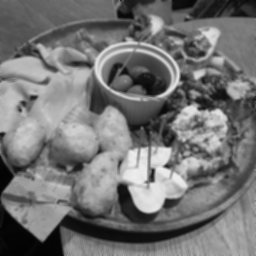

# 先端画像処理・ロボティクス特論 第2回 (2018/10/24) レポート課題

## 学籍番号: AL15069
## 氏名: 小野 義基
<br>

### 共同作業者
- AF15043 坂内力
- AF15045 佐藤康平
<br>

## 概要
- 講義を参考に、メディアンフィルタ、平均値フィルタ、ガウシアンフィルタを生成するプログラムを実装しました
- 第1回課題で作成したbitmap処理クラスを再利用して実装しました
<br>

## `ソースコード等` ディレクトリの構成
```
ソースコード等/
　├ 2nd.cpp    `グレースケール、ヒストグラム、2値化画像などの処理`
　├ bitmap_manager.cpp    `bmp画像の読み書きなどを管理するクラス (メソッドなどを追加しています)`
　├ bitmap_manager.hpp    `bitmap_manager用のヘッダ`
　│
　├ src/
　│　├ img.bmp    `元画像1`
　│　├ img2.bmp    `元画像2`
　│　└ img3.bmp    `元画像3`
　│
　├ dst/
　│　├ img_gray.bmp    `グレースケール画像`
　│　├ img_avarageFilter.bmp    `平均値フィルタ画像`
　│　├ img_gaussianFilter.bmp    `ガウシアンフィルタ画像`
　│　├ img_medianFilter.bmp    `メディアンフィルタ画像`
　│　... img2, img3も同様
　│
　└ Makefile    `Makeファイル`
```
<br>
<br>


## 使い方

### 準備
- srcフォルダにbmpファイルをおいてください。

### コンパイル方法
``` sh
make
./2nd bitmap_filename
```
`bitmap_filename` は `src` ディレクトリに置いた画像の名前です

ex) `img`, `img2`, `img3`

### 出力
- `dst/` -> 各処理画像

### 注意
- トップダウン方式のbmpファイルは読み込めません。
<br>

## 元画像と出力画像
他の画像での例は `ソースコード等` フォルダの中の `dst` フォルダに格納してあります。
- 元画像: <br>
- グレースケール画像: <br>
- 平均値フィルタ画像: <br>
- ガウシアンフィルタ画像: <br>
- メディアンフィルタ画像: <br>