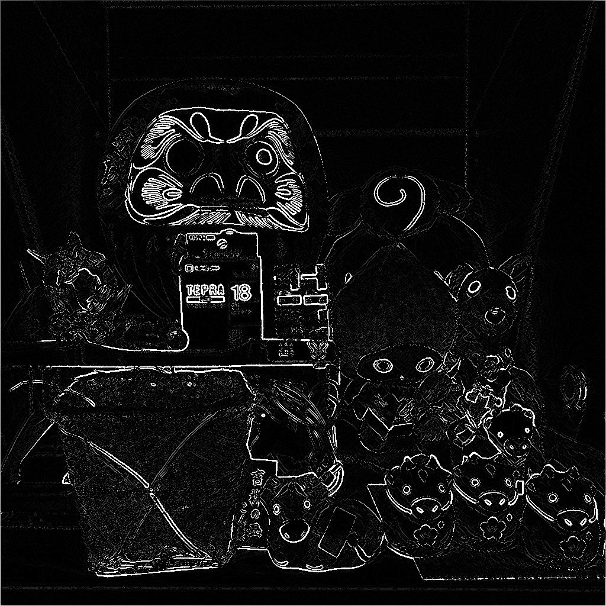

# 先端画像処理・ロボティクス特論 第3回 (2018/11/14) レポート課題

## 学籍番号: AL15069
## 氏名: 小野 義基
<br>

### 共同作業者
- AF15043 坂内力
- AF15045 佐藤康平
<br>

## 概要
- 講義を参考に、Canny法によるエッジフィルタプログラムを実装しました
- 第1回課題で作成したbitmap処理クラスを再利用して実装しました
<br>

## `ソースコード等` ディレクトリの構成
```
ソースコード等/
　├ 3rd_canny.cpp    `Canny法の処理`
　├ bitmap_manager.cpp    `bmp画像の読み書きなどを管理するクラス`
　├ bitmap_manager.hpp    `bitmap_manager用のヘッダ`
　│
　├ src/
　│　├ img.bmp    `元画像1`
　│　├ img2.bmp    `元画像2`
　│　└ img3.bmp    `元画像3`
　│
　├ dst/
　│　├ img_gauss.bmp    `5x5 ガウシアンフィルタ 画像`
　│　├ img_sobel.bmp    `Sobelフィルタ画像`
　│　├ img_sup.bmp    `最大値抑制処理画像`
　│　├ img_canny.bmp    `Canny法の最終出力画像`
　│　... img2, img3も同様
　│
　└ Makefile    `Makeファイル`
```
<br>
<br>


## 使い方

### 準備
- srcフォルダにbmpファイルをおいてください。

### コンパイル方法
``` sh
make
./3nd_canny bitmap_filename
```
`bitmap_filename` は `src` ディレクトリに置いた画像の名前です

ex) `img`, `img2`, `img3`

### 出力
- `dst/` -> 各処理画像

### 注意
- トップダウン方式のbmpファイルは読み込めません。
<br>

## 元画像と出力画像
他の画像での例は `ソースコード等` フォルダの中の `dst` フォルダに格納してあります。
- 元画像: <br>
- 5x5 ガウシアンフィルタ 画像: <br>
- Sobelフィルタ画像: <br>
- 最大値抑制処理画像: <br>
- Canny法の最終出力画像: <br>