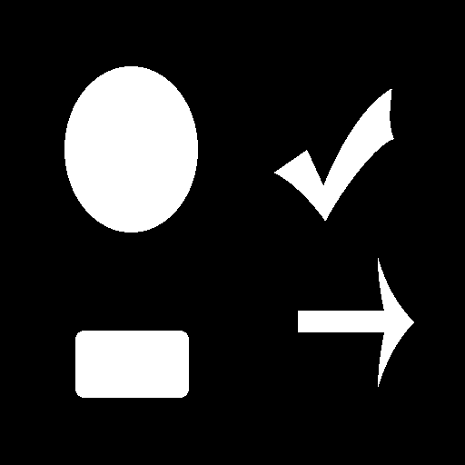

# 先端画像処理・ロボティクス特論 レポート <br> [ラベリング]
学籍番号: AL15069
氏名: 小野 義基
提出日: 2018/12/12

## 共同作業者
- AF15043 坂内力
- AF15045 佐藤康平

## 概要
- ラベリング処理を行うプログラムを作成しました。
- 第1回課題で作成したbitmap処理クラスを再利用して実装しました

## `ソースコード等` ディレクトリの構成
```
ソースコード等/
　├ 4th.cpp    `ラベリングの処理`
　├ bitmap_manager.cpp    `bmp画像の読み書きなどを管理するクラス`
　├ bitmap_manager.hpp    `bitmap_manager用のヘッダ`
　│
　├ src/
　│　├ hoge.bmp    `元画像 (簡単な図形)`
　│　├ img.bmp    `元画像1`
　│　├ img2.bmp    `元画像2`
　│　└ img3.bmp    `元画像3`
　│
　├ dst/
　│　├ hoge_gray.bmp    `グレイスケール画像`
　│　├ hoge_binarization.bmp    `2値化画像`
　│　├ hoge_classification.bmp    `ラベリング画像: ラベル化されたブロックに赤枠をつけてあります`
　│　... img, img2, img3も同様
　│
　└ Makefile    `Makeファイル`
```

## 使い方

### 準備

- `src`フォルダに`bmp`ファイルをおいてください。

### コンパイル方法
``` sh
make
./4th bitmap_filename
```
`bitmap_filename` は `src` ディレクトリに置いた画像の名前です

ex) `hoge`, `img`, `img2`, `img3`

### 出力
- `dst/`: 各処理画像
    ラベリングされた各部分を赤枠で囲った画像を出力しています。

- 標準出力: ラベリングされた図形を含む矩形の頂点情報
    
    例: `hoge.bmp`に対する頂点情報は以下の通りです
    ``` bash
    ===== Label Information =====

    0 (top, bottom, left, right) = (74, 147, 83, 207)
    1 (top, bottom, left, right) = (86, 227, 328, 455)
    2 (top, bottom, left, right) = (256, 438, 71, 217)
    3 (top, bottom, left, right) = (269, 413, 302, 433)

    ===== Label Information End. =====
    ```

### 注意
- トップダウン方式のbmpファイルは読み込めません。

<div style="page-break-before:always"></div>

## 元画像と出力画像
他の画像での例は `ソースコード等` フォルダの中の `dst` フォルダに格納してあります。


|元画像|グレースケール画像|
|:-|:-|
|||
<br>

|2値画像|ラベリング画像|
|:-|:-|
|||