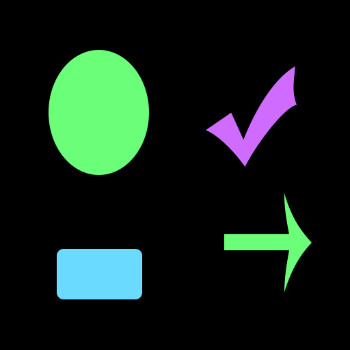
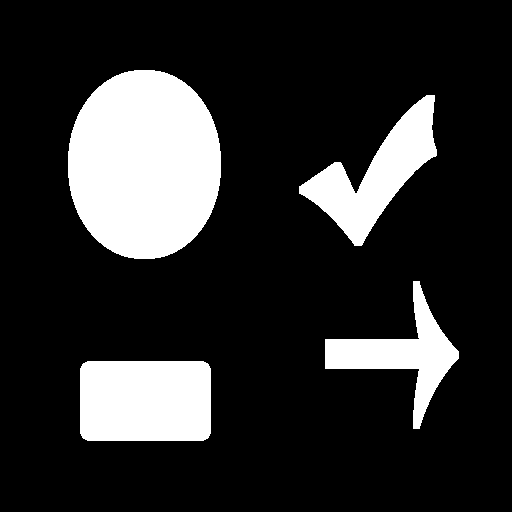
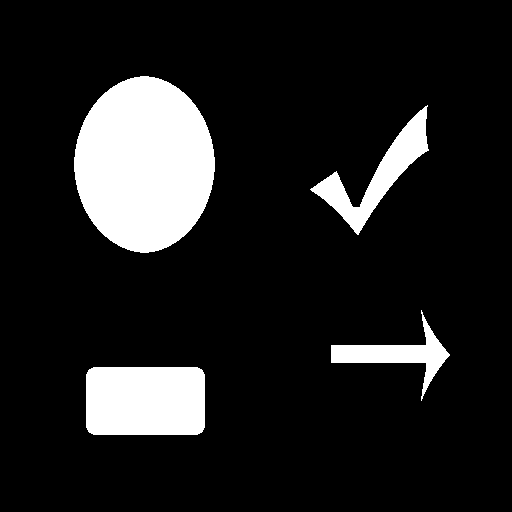

# 先端画像処理・ロボティクス特論 レポート <br> [膨張・縮小]
学籍番号: AL15069
氏名: 小野 義基
提出日: 2018/12/12

## 共同作業者
- AF15043 坂内力
- AF15045 佐藤康平

## 概要
- 膨張・縮小処理を行うプログラムを作成しました。
- 第1回課題で作成したbitmap処理クラスを再利用して実装しました

## `ソースコード等` ディレクトリの構成
```
ソースコード等/
　├ 5th.cpp    `膨張・縮小の処理`
　├ bitmap_manager.cpp    `bmp画像の読み書きなどを管理するクラス`
　├ bitmap_manager.hpp    `bitmap_manager用のヘッダ`
　│
　├ src/
　│　├ hoge.bmp    `元画像 (簡単な図形)`
　│　├ img.bmp    `元画像1`
　│　├ img2.bmp    `元画像2`
　│　└ img3.bmp    `元画像3`
　│
　├ dst/
　│　├ hoge_gray.bmp    `グレイスケール画像`
　│　├ hoge_binarization.bmp    `2値化画像`
　│　├ hoge_dilation.bmp    `膨張画像 (3回)`
　│　├ img_erosion.bmp    `縮小画像 (3回)`
　│　... img, img2, img3も同様
　│
　└ Makefile    `Makeファイル`
```

## 使い方

### 準備

- `src`フォルダに`bmp`ファイルをおいてください。
- `5th.cpp`の7行目の `DILATION_MAX`と`EROSION_MAX` の値を変更することで、膨張と縮小の回数を指定できます。

``` c++
#define DILATION_MAX 3
#define EROSION_MAX 3
```

### コンパイル方法
``` sh
make
./5th bitmap_filename
```
`bitmap_filename` は `src` ディレクトリに置いた画像の名前です

ex) `hoge`, `img`, `img2`, `img3`

### 出力
- `dst/` -> 各処理画像

### 注意
- トップダウン方式のbmpファイルは読み込めません。

<div style="page-break-before:always"></div>

## 元画像と出力画像
他の画像での例は `ソースコード等` フォルダの中の `dst` フォルダに格納してあります。


|元画像|2値画像|
|:-|:-|
|||
<br>

|膨張画像(3回)|縮小画像(3回)|
|:-|:-|
|||